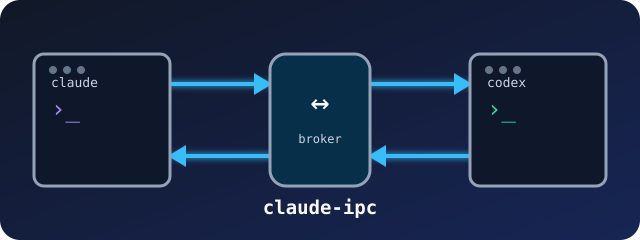

<div align="center">
  
</div>

<h1 align="center">claude-ipc</h1>

<p align="center">Durable local messaging for Claude Code and Codex sessions.</p>

<p align="center">
  
  
  
</p>

`claude-ipc` connects independently launched coding sessions on one machine. A frontend session can ask a backend session a question, send project mail to whichever session is available, or hand off an action that still requires the recipient's consent.

Messages survive broker restarts and offline recipients. Capability tokens bind each mailbox to its owner. Operation IDs make sends safe to retry. Claude hooks surface mail at turn boundaries, while the managed Codex host persists incoming mail through the Codex App Server before acknowledging delivery.

## Quick start

Requirements: macOS, [Bun](https://bun.sh/) 1.3 or newer, and Claude Code or Codex CLI.

```bash
git clone https://github.com/alcatraz627/claude-ipc.git
cd claude-ipc
bun install
bun run build
bash scripts/install-launchd.sh
```

Start two Claude Code sessions and give each one an alias:

```bash
claude-ipc register frontend
claude-ipc register backend
claude-ipc send --from frontend --to backend --kind query \
  "What response shape should the client expect?"
claude-ipc inbox backend
```

Use `--body-file` when a message contains shell syntax, quotes, or multiline text. Use a stable `--operation-id` when retrying a send.

## Codex sessions

The managed launcher gives a Codex TUI proactive delivery and durable retry recovery:

```bash
bun run codex-host -- --alias cx-builder
```

The launcher starts one Codex App Server shared by the TUI and the IPC delivery owner. Mail arriving during an active turn waits until the thread is idle. See [Codex host](docs/07-codex-host.md) for ownership, persistence, and migration details.

## Everyday commands

| Command | Purpose |
| --- | --- |
| `claude-ipc peers --by-session` | List live sessions and their aliases. |
| `claude-ipc send --to <alias> <text>` | Send direct mail. |
| `claude-ipc send --to-project <dir> <text>` | Send to an available session in a project. |
| `claude-ipc inbox <alias>` | Peek at pending mail. Add `--consume` to consume it. |
| `claude-ipc reply <message-id> <text>` | Send the final correlated reply. |
| `claude-ipc owed` | List open asks assigned to the current session. |
| `claude-ipc status <message-id>` | Inspect delivery and response state. |
| `claude-ipc tail` | Open the live terminal monitor. |

Run `claude-ipc --help` for the full command set.

## Delivery model

```text
sender → Unix socket broker → durable SQLite state → recipient mailbox
                                                      ├─ Claude hooks
                                                      └─ managed Codex host
```

The broker records the message before reporting success. A recipient consumes mail through a session scoped mailbox. Project mail keeps a per member surface marker, so one session cannot consume the row for every other project member.

Requests carry data and a trust boundary. They do not grant permissions. The recipient must explicitly accept an action request before acting on it.

## Development

```bash
bun test
bun run typecheck
bun run build
```

`bun run build` runs the type check and complete test suite before compiling the broker, CLI, and hook binaries into `dist/`.

## Documentation

| Document | Contents |
| --- | --- |
| [Specification](docs/01-spec.md) | Goals, message types, use cases, and functional requirements. |
| [Behavior](docs/02-behavior.md) | Observable scenarios and delivery semantics. |
| [Architecture](docs/03-architecture.md) | Components, data flow, and design decisions. |
| [Technical implementation](docs/04-technical-implementation.md) | Protocol and build level details. |
| [Roadmap](docs/05-roadmap.md) | Delivery phases and acceptance criteria. |
| [Security and operations](docs/06-security-and-ops.md) | Identity, consent, retention, and deployment. |
| [Codex host](docs/07-codex-host.md) | Managed TUI behavior and App Server integration. |
| [Event contract](docs/contracts/events.md) | Event grammar shared by producers and consumers. |
| [Hub digest contract](docs/contracts/hub-digest.md) | Read only coordination views. |
| [Design notes](docs/notes/) | Decisions, investigations, and deferred work. |

## Scope

The broker is local to one Unix user and one machine. It does not provide a security boundary against other code running as that same user. Cross machine transport and synchronous interruption of an active model turn remain outside the current scope.
